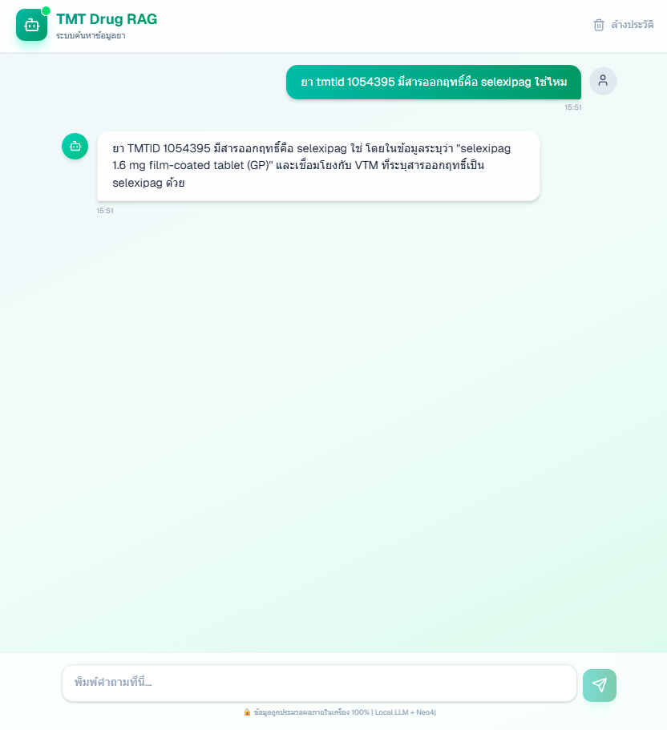
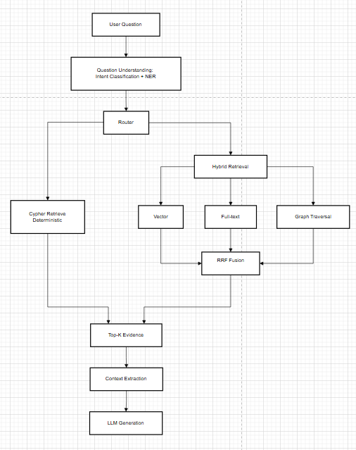

# TMT Drug RAG

GraphRAG proof-of-concept for question answering over **Thai Medicinal Terminology (TMT)** — the drug-data standard published by Thailand's Ministry of Public Health. Built as an internship deliverable and a working example of hybrid retrieval (vector + fulltext + graph traversal) for pharmaceutical Q&A in Thai.



---

## Architecture



The backend is an LCEL chain in [`apps/api/src/pipeline.py`](apps/api/src/pipeline.py):

```
Transform (AQT) → Search → Extract → Format
```

| Stage | Module | What it does |
|---|---|---|
| **Transform** | [`services/aqt.py`](apps/api/src/services/aqt.py) | rule-based + ML query understanding (no LLM): regex strategy detection, embedding-similarity intent classification, optional NER for slot extraction (DRUG, BRAND, MANUFACTURER, FORM, STRENGTH), filter normalisation |
| **Search** | [`services/search.py`](apps/api/src/services/search.py) | hybrid Neo4j retrieval: vector similarity + fulltext + graph traversal. Deterministic Cypher routes (`id_lookup`, `analyze_count`, `list`) skip the top-K cap; `lookup` runs through a cross-encoder reranker |
| **Extract → Format** | [`services/extraction.py`](apps/api/src/services/extraction.py), [`services/formatting.py`](apps/api/src/services/formatting.py) | project seeds + expanded subgraph into a structured context, then call the LLM via `langchain_ollama` (or a deterministic numeric renderer for `count` intent) |

## Tech stack

| Layer | Choice | Notes |
|---|---|---|
| Backend | Python 3.10, FastAPI, LangChain (LCEL) | `/chat` wraps the pipeline in `asyncio.wait_for` → HTTP 504 on timeout |
| Frontend | Next.js 16 (App Router), React 19, Tailwind v4 | minimal SPA chat client at `apps/web` |
| Graph store | Neo4j 5.15 with vector + fulltext indexes | single-query hybrid search |
| LLM | Ollama-served `qwen2.5:7b-instruct` | local inference, 8 GB VRAM-friendly |
| Embedding | `bge-m3` (1024-dim) | Thai-capable BGE model |
| Reranker | cross-encoder (sentence-transformers); `RERANKER_DEVICE=auto` default (CUDA if available, else CPU) | applied for `lookup` intent only; set `cpu` on 8 GB cards to keep VRAM for the LLM |
| Intent classification | embedding-similarity to precomputed centroids | dataset in [`apps/api/src/api/intent_dataset.json`](apps/api/src/api/intent_dataset.json) |
| NER | WangchanBERTa fine-tuned on TMT | weights not committed; see [`experiments/question_understanding/ner_finetuning`](experiments/question_understanding/ner_finetuning) |

---

## Quick start (Docker Compose)

```powershell
Copy-Item infra\.env.example infra\.env
# edit infra\.env: set NEO4J_PASSWORD, NEO4J_AUTH
cd infra
docker compose up --build
```

| Service | URL |
|---|---|
| Web (chat UI) | http://localhost:3000 |
| API | http://localhost:8000 |
| Neo4j Browser | http://localhost:7474 |

The compose file builds `apps/api` and `apps/web` from the repo root and volume-mounts `apps/api/{artifacts,cache,logs}` into the API container.

### Smoke test

Once the API is up, hit `/chat` directly to confirm the pipeline answers end-to-end:

```powershell
$body = @{ message = 'ยา tmtid 1054395 มีสารออกฤทธิ์คือ selexipag ใช่ไหม' } | ConvertTo-Json
Invoke-RestMethod -Uri http://localhost:8000/chat -Method Post -ContentType 'application/json; charset=utf-8' -Body $body
```

Returns `{ "response": "..." }`. `GET /health` reports pipeline readiness; `GET /` returns service status.

---

## Project layout

```
apps/
  api/          FastAPI backend + GraphRAG runtime
  web/          Next.js chat client
infra/          Docker Compose, shared .env template
experiments/
  question_understanding/
    intent_classification/   # benchmarks, datasets, concept papers
    ner_finetuning/          # WangchanBERTa fine-tune pipeline
  retrieval/
    retrieval_eval/          # retrieval ablations and evaluation
docs/
  architecture.md
  security/                  # hygiene + audit playbook
scripts/
  audit_history.sh           # 6-check repo audit (run before public release)
```

---

## Local development

Backend:

```powershell
cd apps/api
python -m venv .venv
.\.venv\Scripts\Activate.ps1
pip install -r requirements.txt
Copy-Item ..\..\infra\.env.example .env
python src/api/main.py    # uvicorn at http://localhost:8000
```

Frontend:

```powershell
cd apps/web
Copy-Item .env.local.example .env.local
npm install
npm run dev               # http://localhost:3000
```

### Tests

```powershell
cd apps/api
pytest tests/             # heavy deps mocked in conftest.py — no Neo4j/Ollama/model weights needed
```

### Pre-commit hooks

```powershell
pip install pre-commit
pre-commit install
```

Runs `detect-secrets`, `check-added-large-files` (50 MB cap), and conflict/whitespace fixers on every commit. See [`docs/security/hygiene-test-plan.md`](docs/security/hygiene-test-plan.md) for the verification procedure.

---

## Configuration

Selected env vars (full list and defaults live in [`apps/api/src/config.py`](apps/api/src/config.py); required vars are validated at startup):

| Var | Required | Notes |
|---|---|---|
| `NEO4J_URI`, `NEO4J_USER`, `NEO4J_PASSWORD` | yes | hybrid retrieval target |
| `OLLAMA_URL`, `OLLAMA_EMBED_URL` | yes | LLM + embedding endpoints |
| `LLM_MODEL`, `EMBED_MODEL` | yes | model tags pulled in Ollama |
| `VECTOR_INDEX_NAME`, `FULLTEXT_INDEX_NAME`, `EMBEDDING_DIM` | yes | Neo4j index names + embedding dim |
| `INTENT_V2_ENABLED` | default `true` | embedding-centroid intent classifier |
| `INTENT_V2_USE_NER` | code default `true`; compose overrides to `false` | NER weights aren't committed — leave off until `apps/api/artifacts/ner/final_model` is populated, otherwise the API fails to load |
| `NLEM_QA_ENABLED` | default `false` | NLEM (national essential drug list) Q&A is gated off |
| `CHAT_TIMEOUT_SECONDS` | default `120` | `/chat` returns HTTP 504 after this |
| `RERANKER_DEVICE` | default `auto` (`auto` / `cpu` / `cuda`) | `auto` picks CUDA if available, else CPU; set `cpu` to keep VRAM free for the LLM on 8 GB cards |
| `LOG_LEVEL` | default `INFO` | central `setup_logging()` in [`apps/api/src/logging_config.py`](apps/api/src/logging_config.py) |

---

## Experiments

Self-contained research areas with their own READMEs:

- [Intent classification](experiments/question_understanding/intent_classification) — embedding model selection, FCI/HIC intent benchmarks, concept paper draft
- [NER fine-tuning](experiments/question_understanding/ner_finetuning) — WangchanBERTa fine-tune for TMT slot extraction
- [Retrieval evaluation](experiments/retrieval/retrieval_eval) — Cypher route ablations, RRF vs reranker comparisons

Datasets (train/val/test, entities) are committed under each experiment's `datasets/` subdir. Model weights are **not** committed — re-train via the per-experiment runbook, or pull from HuggingFace once published.

---

## Known limitations

- **NER weights not committed.** Download from HuggingFace (link TBD) or re-train via [`experiments/question_understanding/ner_finetuning/run/finetune_ner.py`](experiments/question_understanding/ner_finetuning/run/finetune_ner.py); tokenizer + config artifacts are committed under `artifacts/final_model/`.
- **Hardware target: 8 GB VRAM (RTX 4060).** `RERANKER_DEVICE` defaults to `auto` (CUDA if available, else CPU). On 8 GB cards, set `cpu` to leave VRAM for the 7B LLM; set `cuda` only if you have headroom.
- **Thai-leaning.** English queries work for several intent classes but the centroid dataset is Thai-dominant.
- **NLEM Q&A is gated off** by default — questions about Thailand's National List of Essential Medicines are short-circuited unless `NLEM_QA_ENABLED=true`.

---

## License

[MIT](LICENSE).
