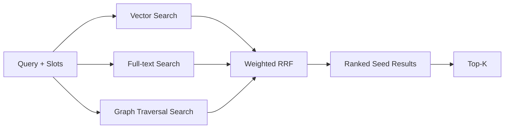

# Part II: AI Assistant for Clinical Decision Support
## Retrieval-Focused Technical Document (TMT Knowledge Base)

Version: 2026-03-08  
Owner: GenAI Project (TMT domain)

---

## 1) Executive Summary
This document explains how the AI assistant retrieves TMT knowledge for chatbot responses in a Clinical Decision Support context. The focus is retrieval quality, because retrieval quality directly controls answer quality for small/local LLM setups.

Key conclusion from current experiments:
- Use `RRF-only` as default retrieval ranking.
- Apply reranker selectively for `lookup` only.
- Do not apply reranker globally to all operators (`list/compare` degrade when reranked globally).

Primary evidence files:
- `experiments/retrieval/retrieval_eval/results/rrf_vs_reranker_static_20260307_170847_summary.json`
- `experiments/retrieval/retrieval_eval/results/rrf_vs_lookup_only_rerank_static_20260307_210306_summary.json`
- `experiments/question_understanding/intent_classification/results/benchmark_intent_v2_vs_legacy_20260220_134337.json`
- `experiments/question_understanding/intent_classification/results/synthetic_regression/20260226_154314_aqt_phase1_synthetic.jsonl`

---

## 2) Part II Concept (Big Picture)
### 2.1 Clinical workflow concept
Medical staff ask a chatbot in natural language.  
The chatbot uses an LLM, but before answering it must retrieve evidence from TMT knowledge base (graph + indexed text/embedding).

High-level flow:
1. User question arrives.
2. Intent + slot extraction (AQT + NER/rules).
3. GraphRAG retrieval searches TMT with hybrid methods.
4. Top-K results + related graph context are selected.
5. Structured context is sent to LLM for response generation.

### 2.2 Scope
This phase is scoped to **TMT only** as the knowledge base.
- In-scope: TMT concepts and relations (SUBS, VTM, GP, GPU, TP, TPU), manufacturer, formula/strength, hierarchy.
- Out-of-scope: external non-TMT medical corpora, guideline PDFs as authoritative KB, multi-hospital EHR fusion, and NLEM (National List of Essential Medicines) queries.

### 2.3 Example use cases
1. Exact lookup: `what is tmtid 662401`
2. Drug info: `ข้อมูลยา paracetamol`
3. Manufacturer listing: `รายการยาของผู้ผลิต GPO`
4. Compare: `เปรียบเทียบ paracetamol กับ ibuprofen`
5. Verify claim: `MACROPHAR ผลิต paracetamol หรือไม่`

---

## 3) Overall Architecture
### 3.1 End-to-end process

### 3.2 Retrieval sub-architecture

---

## 4) Intent Classification (<= 3 slides)
> Recommended presentation split: 3 slides exactly.

### Slide 1: Concept
Intent is separated into:
- `action_intent` (what to do): lookup, verify, list, count, compare, unknown
- `facet/topics_intents` (what information dimension): manufacturer, substance, formula, hierarchy, id_lookup

Reason:
- Stable action classes improve routing behavior.
- Multi-label facets improve constraint extraction for retrieval.

### Slide 2: Technique + experiment method
Technique used:
- Embedding centroid similarity classifier (legacy vs split-head design)
- Hybrid slot extraction from NER + rule override (ID, manufacturer aliases)

Current deployment policy:
- NLEM questions are rejected as out-of-scope until NLEM data is ingested into the knowledge base.

Experiment setting (from benchmark file):
- File: `experiments/question_understanding/intent_classification/results/benchmark_intent_v2_vs_legacy_20260220_134337.json`
- Two evaluation modes:
1. Random split (in-domain style)
2. Compositional holdout (harder generalization)

### Slide 3: Results + conclusion
Random split:
- Legacy joint_acc: `0.7333`
- V2 joint_acc: `0.7000` (similar scale)

Compositional holdout (important):
- Legacy joint_acc: `0.0000`
- V2 joint_acc: `0.2556`
- V2 action_acc: `0.5333` vs Legacy `0.3333`

Interpretation:
- For real query variation, split-head V2 generalizes better when combinations are unseen.
- For production routing, V2 structure is preferred despite slight latency increase.

---

## 5) Information Extraction (<= 3 slides)
> Recommended presentation split: 3 slides exactly.

### Slide 1: Concept
Information extraction converts retrieved graph nodes/edges into compact structured context for LLM.

Main goals:
- Preserve evidence fields (tmtid, level, names, manufacturer, formula/strength attributes).
- Keep token usage small by returning only top relevant fields/entities.
- Keep multi-entity slots (e.g., compare query with 2 drugs).

### Slide 2: Technique + experiment method
Technique:
- NER + regex/rule post-processing
- Slot sanitation policies:
  - drop noisy brand when conflicts with exact TMTID
  - keep multi-drug extraction for compare
  - fallback to `query` slot when NER gives no reliable entity

Validation datasets:
- `experiments/question_understanding/intent_classification/results/synthetic_regression/20260226_154204_aqt_phase1_synthetic.jsonl`
- `experiments/question_understanding/intent_classification/results/synthetic_regression/20260226_154314_aqt_phase1_synthetic.jsonl`

### Slide 3: Results + conclusion
Synthetic phase-1 extraction checks:
- Round 1: `7/8` pass (`87.5%`)
- Round 2: `8/8` pass (`100%`) after slot sanitation fixes

Example improvements:
- ID lookup no longer leaks brand noise from `TMTID ...`
- Compare query preserves multi-drug slots
- Manufacturer Thai query conflict handled via rule fallback

Interpretation:
- Current extraction quality is sufficient for PoC integration.
- Next improvement should be standardized IE benchmark (entity-level precision/recall/F1).

---

## 6) GraphRAG Retrieval
### 6.1 Concept
Retrieval concept in this system:
1. Search
2. Retrieve candidates
3. Rank/fuse
4. Select Top-K
5. Send selected evidence/context to chatbot

### 6.2 Searching techniques used
1. Graph Traversal (relationship search)
- Uses TMT relations to expand neighborhood around anchors.
- Useful for hierarchy and product-family context.

2. Full-text search (keyword search)
- Useful for exact names/aliases/manufacturer strings.

3. Vector similarity (semantic search)
- Useful for paraphrase/semantic queries with weak keyword overlap.

Fusion:
- Weighted RRF combines rank positions from all channels.

### 6.3 Technique and experimental method
Dataset construction:
- Ground truth from real database snapshot:
  - `experiments/retrieval/retrieval_eval/data/phase1_ground_truth.json`
- Silver queries generated from ground truth:
  - `experiments/retrieval/retrieval_eval/data/phase2_silver_queries.json`

Phase-2 silver summary:
- Total: `942` queries
- Retrieval family: `700`
- Count: `122`
- Verify: `120`

Retrieval metrics:
- `Hit@1, Hit@3, Hit@5, Hit@10`
- `P@5, R@5`
- `MRR`
- `nDCG@10`

### 6.4 Results and conclusion
#### A) Baseline vs global reranker (negative result)
From:
- `experiments/retrieval/retrieval_eval/results/rrf_vs_reranker_static_20260307_170847_summary.json`

Overall retrieval (700 queries):
- `MRR`: 0.748988 -> 0.696575 (`-0.052413`)
- `Hit@10`: 0.868571 -> 0.847143 (`-0.021429`)

Conclusion:
- Global reranking harms list/compare behavior.

#### B) Selected strategy: RRF default + lookup-only rerank
From:
- `experiments/retrieval/retrieval_eval/results/rrf_vs_lookup_only_rerank_static_20260307_210306_summary.json`

Overall retrieval (700 queries):
- `Hit@10`: 0.868571 -> 0.884286 (`+0.015714`)
- `MRR`: 0.748988 -> 0.749754 (`+0.000766`)
- `nDCG@10`: 0.730046 -> 0.735349 (`+0.005302`)
- `Hit@1`: 0.681429 -> 0.670000 (`-0.011429`)

Semantic subset (lookup/list/compare = 460 queries):
- `Hit@10`: +0.023913
- `MRR`: +0.001165
- `nDCG@10`: +0.008069

Operator-level interpretation:
- `lookup`: improves at deeper ranks (Hit@3/5/10)
- `list` and `compare`: unchanged (rerank intentionally bypassed)
- `id_lookup`: unchanged (already deterministic)

Final retrieval policy recommendation:
- Keep `RRF-only` as default.
- Enable reranker only for `lookup`.

---

## 7) Suggested Presentation Flow (non-technical audience)
1. Problem: “LLM answer quality depends on retrieval quality.”
2. Scope: “This PoC uses only TMT knowledge base.”
3. Architecture: “Question -> Understand -> Retrieve -> Answer.”
4. Intent + IE: “Understand what user wants and extract key entities.”
5. Retrieval methods: “Keyword + Semantic + Graph relationships.”
6. Experiment evidence: show before/after metrics.
7. Decision: “Use selective rerank policy.”
8. Next step: scale benchmark and monitor in real traffic.

---

## 8) Current Limitations and Next Steps
Limitations:
- Information extraction still lacks a formal large-scale IE gold benchmark.
- Retrieval gains are moderate; hit@1 slightly dropped under lookup-only rerank.
- Some cross-lingual/manufacturer edge cases still need robust normalization.
- NLEM questions are currently blocked by policy because NLEM data is not loaded yet.

Next steps:
1. Add formal IE benchmark (entity precision/recall/F1 by slot type).
2. Add confidence gating for lookup rerank (apply rerank only when RRF top gap is small).
3. Extend semantic hard-query set and monitor by operator-level KPIs.

---

## 9) Appendix: Slide-ready one-line conclusions
- “Hybrid retrieval with RRF gives stable baseline across TMT query types.”
- “Global reranking is harmful; selective reranking is better.”
- “Current best policy improves Hit@10 and nDCG while preserving deterministic routes.”
